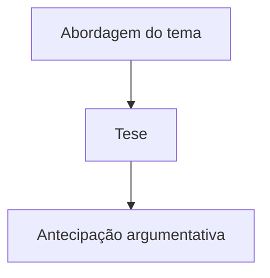

```mermaid
graph TD
A[Abordagem do tema] --> B[Tese] --> C[Antecipação argumentativa]
```

[[Abordagem do tema]]
[Tese](Tese.md)
[Antecipação argumentativa](Antecipa%C3%A7%C3%A3o%20argumentativa.md)