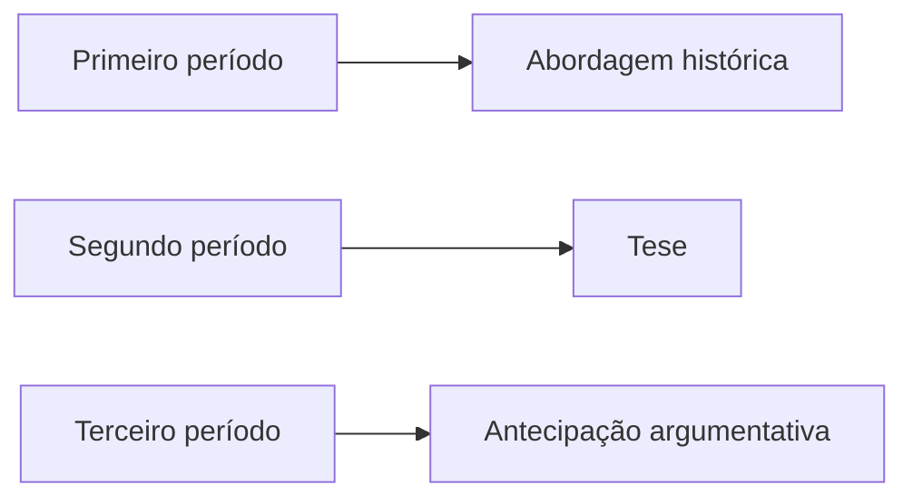

Estrutura formada por: 

```mermaid
graph LR
	A[Primeiro período] --> B[Abordagem histórica]
    C[Segundo período] --> D[Tese]
    E[Terceiro período] --> F[Antecipação argumentativa]

click B "obsidian://vault/Ankivault/Abordagem%20hist%C3%B3rica.md"
click D "obsidian://vault/Ankivault/Tese.md"
click F "obsidian://vault/Ankivault/Antecipa%C3%A7%C3%A3o%20argumentativa.md"
```           

---
Reference:

[[Abordagem histórica]]\
[[Tese]]\
[[Antecipação argumentativa]]

#zettel 