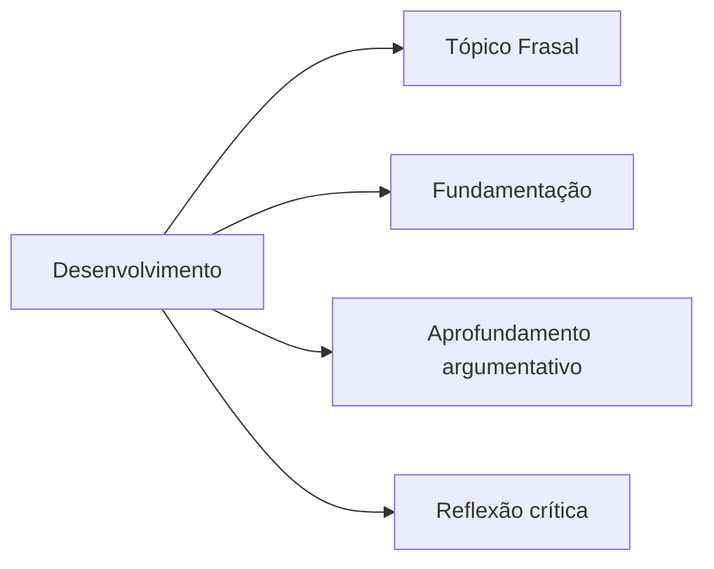

```mermaid
graph LR
	A[Desenvolvimento] --> B[Tópico Frasal]
    A[Desenvolvimento] --> C[Fundamentação]
    A[Desenvolvimento] --> D[Aprofundamento argumentativo]
	A[Desenvolvimento] --> E[Reflexão crítica]

click B "obsidian://vault/Ankivault/T%C3%B3pico%20Frasal.md"
click C "obsidian://vault/Ankivault/Fundamenta%C3%A7%C3%A3o.md"
click D "obsidian://vault/Ankivault/Aprofundamento%20argumentativo.md"
click E "obsidian://vault/Ankivault/Reflex%C3%A3o%20cr%C3%ADtica.md"
``` 

---
Reference:\
[[Tópico Frasal]]\
[[Fundamentação]]\
[[Aprofundamento argumentativo]]\
[[Reflexão crítica]]

#zettel 